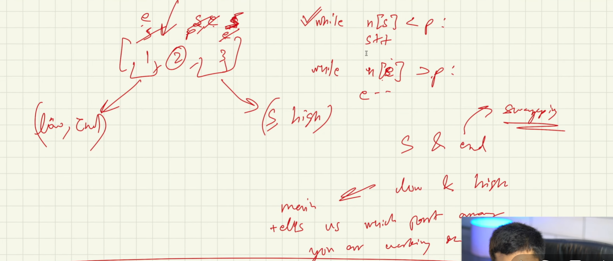

Quick Sort 
-   Take low and high i.e first and last element of array
-   Take copy of low to s and high to e and middle to pivot = arr[mid]
    -   Traverse and increment s until arr's s(th) element is lower than pivot (A)
    -   Traverse and descrement e until arr's s(th) element is higher than pivot (B)
    -   At point when A & B completed and still S haven't crossed e(th) pos
        then it means violation has happened
        -   what violation ? when arr[s] > arr[pivot] or arr[e] < arr[pivot] 
        -   then swap the arr[e] with arr[s]
-   